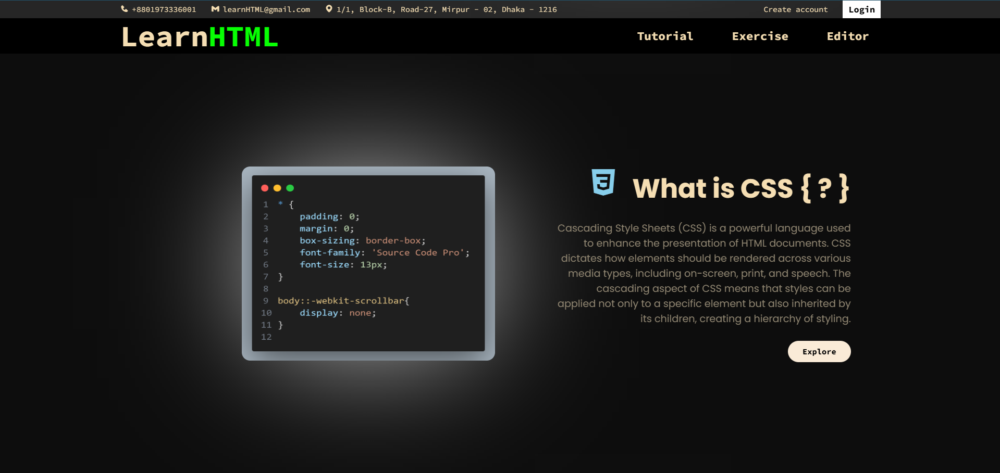
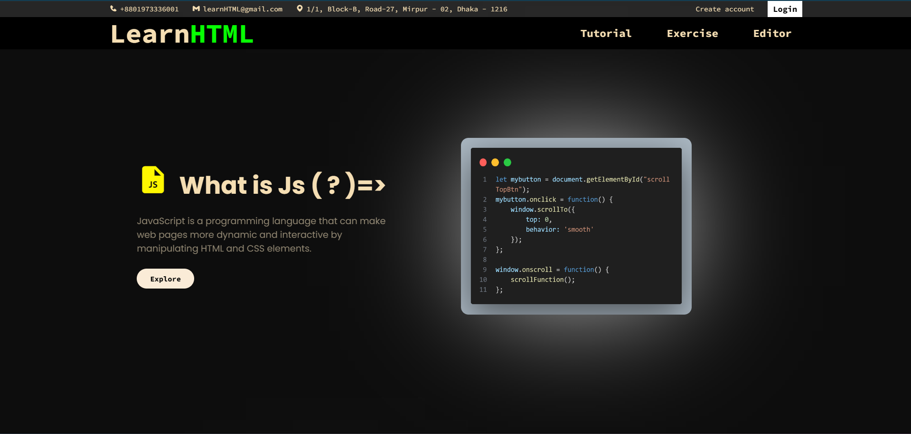

# Project Description

A simple single page website created using only HTML, CSS and Js; designed to serve for learning HTML, CSS, and JavaScript. The project is intended for practice purposes and aims to provide a clean and informative starting point for anyone interested in learning web development.
Click **[Here](https://web-development-learning-platform-d.vercel.app/)** to see live demo

## Technologies Used

- **HTML:** Creating the structure of the web page.
- **CSS:** Styling the web page.
- **Box-icon:** For icons.
- **Google fonts** For different font family.

## Future Plans

- **JavaScript Integration:** Future updates may include adding interactive elements using JavaScript.
- **Additional Pages:** Expansion of the website to include more pages that cover advanced topics in HTML, CSS, and JavaScript.
- **Database integration:** For making this page dynamic and up-to-date.

## Acknowledgments

This project is inspired by the need for a simple, beginner-friendly landing page for learning web development.

## How to Use

1. Clone the repository:
   ```bash
   git clone https://github.com/Anayatul-Ahad-Shoikot/BA-FrontEnd_design_01.git

## Website looks





